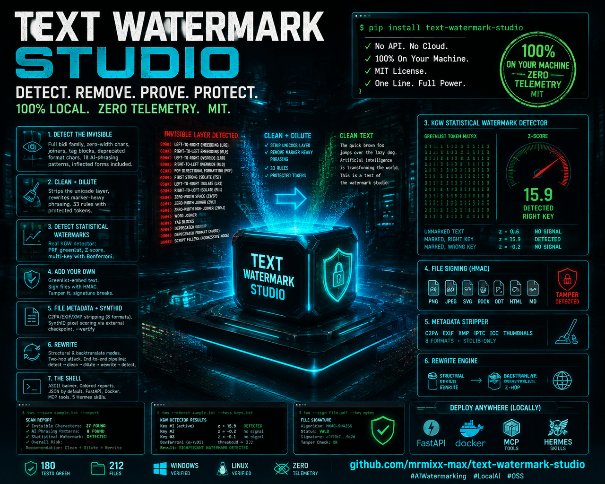
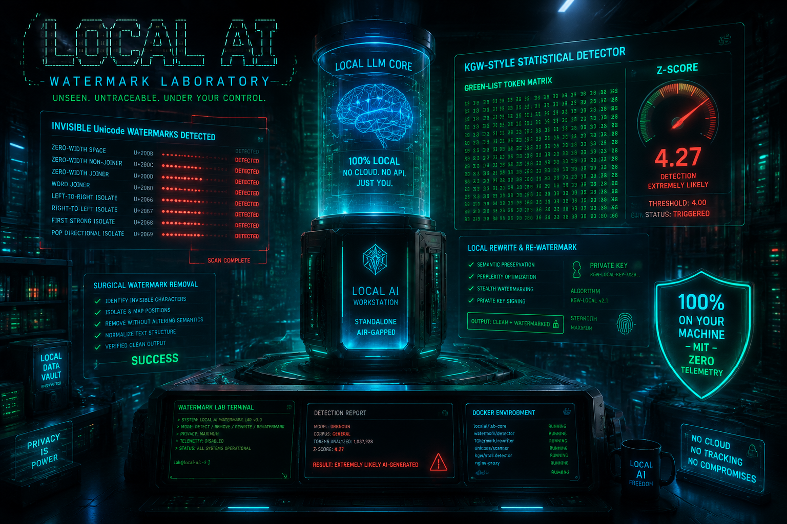
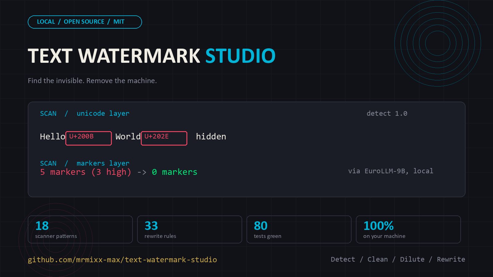

# Text Watermark Studio — Watermarking Lab Edition




Text Watermark Studio v1.0.0 adds a taxonomy-driven watermarking lab with plugin families for Unicode, lexical, syntactic, format/layout, sampling/logit bias, semantic/structure, localized provenance and training-time ownership workflows. Installable: `pip install text-watermark-studio`.

📖 **Documentation:** [User Guide (EN)](docs/USER-GUIDE.md) · [Benutzerhandbuch (DE)](docs/BENUTZERHANDBUCH.md)





## Quickstart

Requires Python 3.10+.

> **Sales catalogs:** [English](docs/marketing/tws-catalog-2026-en.html) · [Deutsch](docs/marketing/tws-catalog-2026-de.html) — one tool, seven application fields. Guides: [User Guide (EN)](docs/USER-GUIDE.md) · [Benutzerhandbuch (DE)](docs/BENUTZERHANDBUCH.md).

```bash
# Install from PyPI (the CLI + library)
pip install text-watermark-studio

# Or from source (editable, with test deps)
python -m venv .venv
# Windows: .\.venv\Scripts\activate | macOS/Linux: source .venv/bin/activate
pip install -e ".[dev]"

# CLI
ai-wm detect tests/fixtures/ai_sample_de.txt --lang de
ai-wm clean tests/fixtures/stego_zwsp.txt -o clean.txt
ai-wm dilute tests/fixtures/ai_sample_en.txt -o diluted.txt --intensity standard
ai-wm pipeline tests/fixtures/ai_sample_de.txt -o out.txt --report report.json
ai-wm serve --host 127.0.0.1 --port 8080

# Tests
pytest -q

# API server
uvicorn ai_watermark_toolkit.api.fastapi_app:app --host 127.0.0.1 --port 8080
```

> **Note:** the CLI + library are on PyPI. The SynthID bootstrap
> (`scripts/setup_synthid.sh`), the `Dockerfile.synthid`, and the bundled
> Hermes skills live in this repository, not the wheel — they are operator
> tooling and skill bundles, not runtime modules. Clone the repo for those.

Alternatively, run the whole stack via Docker:

```bash
docker compose up --build
```

Windows users: the Makefile detects `OS=Windows_NT` and uses `.venv\Scripts` paths automatically. `scripts/publish-check.ps1` runs the full check (venv, install, tests, build) in PowerShell. Desktop packaging for Windows lives in `desktop/packaging/windows/build.ps1`.

## Why a lab edition

Recent taxonomies and surveys split text watermarking into multiple families with different assumptions, requirements and threat models. Existing-text methods, generation-time methods and model-level provenance do not collapse into one universal technique, so the product is structured as a lab with family plugins and capability axes rather than a single misleading detector.

## Statistical watermark detection (KGW)

The forensics layer now includes a real KGW-style statistical detector (`src/ai_watermark_toolkit/forensics/kgw.py`): per token, a pseudorandom hash over `(key, previous_token, token)` decides greenlist membership, and a one-sided Z-test over the whole text separates a watermarked green-rate (~100% for text generated with the matching key) from the expected ~25% of normal text. Multi-key detection tests every registered `kgw`-family key and reports per-key Z-scores with a Bonferroni-style adjustment.

What it detects, honestly: texts generated **with this exact scheme and key**. It is not a universal detector for unknown vendor schemes — key and hash scheme must match. Word-level tokens approximate model tokenizers. Behavioral tests (`tests/test_v113_kgw_detector.py`) include a mini KGW generator that shares the detector's PRF: correct key → Z ≥ 4, wrong key → no signal.

## Included families

- Unicode / zero-width — full bidi + zero-width family (ZWSP/ZWNJ/ZWJ, LRE/RLE/LRO/RLO/PDF, LRI/RLI/FSI/PDI, word joiner, BOM, Mongolian VS, deprecated format chars, tag block, variation selectors) **plus an opt-in aggressive mode** for script-specific fillers (Braille blank, Hangul fillers, object replacement) that standard mode deliberately leaves alone
- Lexical choice
- Syntactic pattern
- Format / layout
- Sampling / logit bias (KGW Z-score detector for registered keys)
- Semantic / structure
- Localized provenance
- Training-time / ownership

## Important limit

This edition includes demo implementations and architectural plugin slots, not universal real-world detectors or embedders for every family. Many families require decoder control, model access, parser stacks or secret key material outside a text-only local lab.

## MCP tools

The lab now ships with an MCP tool manifest under `mcp/tools.json` and a Hermes-compatible plugin bundle under `hermes/`. The manifest exposes API-backed tools for health, readiness, pipeline runs, forensics, labs, ops status and streams.

## Bundled Hermes skills

`hermes/skills/` contains agent skills that work with the studio and its ecosystem:

- `chameleon-universal-tarntarnung` — universal text camouflage: restructure any AI-written text (academic, business, informal) to drop its statistical fingerprint while preserving meaning
- `ai-text-detection-lab` — multi-signal AI-text detection: stylistic, statistical, semantic, structural, provenance and author-comparison evidence with transparent uncertainty instead of binary verdicts
- `dewatermarking-pipeline` — end-to-end removal chain: detect → clean → dilute → local-LLM rewrite → detect, with measured before/after marker reports (verified with EuroLLM-9B: 5 markers to 0)
- `text-forensics-workflow` — full forensic case workflow: secure material, extract text/metadata, scan Unicode + markers, weigh evidence, produce a documented verdict
- `text-watermark-studio-lab` — the studio's own lab skill

Install into Hermes with `hermes skill install <path>` or copy the folder under `~/AppData/Local/hermes/skills/`. Each SKILL.md is MIT-licensed like the repo.

## Document formats

The v1.0.0 edition adds a document layer for txt, markdown, rtf, docx, odt, pdf and epub workflows. Pandoc is widely used as a universal document converter for docx, rtf, odt, epub, markdown and pdf-oriented flows, while specialized libraries like pypdf, python-docx, odfpy, EbookLib and striprtf cover format-specific extraction and manipulation use cases. Current API support focuses on normalization and export pathways through `/api/documents/*`, with Hermes/MCP exposure for agent use.

## File metadata cleaning (C2PA / EXIF / XMP)

The metadata layer strips AI provenance marks from files — stdlib-only, no external tools required:

| Format | What it removes |
| --- | --- |
| PNG | `eXIf` EXIF chunk, XMP hint chunks (`iTXt`/`zTXt`/`tEXt`), C2PA/JUMBF detection |
| JPEG | `APP1` EXIF + XMP segments, `APP11` XMP/AI metadata, C2PA/JUMBF detection |
| SVG | `<metadata>`/RDF blocks, `data-ai-*` provenance attributes |
| PDF | XMP metadata streams (byte-level), Producer/Creator Info entries (best-effort; exiftool remains stronger) |
| DOCX | `customXml/` parts, docProps scrub (creator, lastModifiedBy, revision) |
| ODT | `meta.xml` generator entries |
| HTML | AI `<meta>` tags, JSON-LD provenance blocks, `data-ai*` attributes |
| Markdown | YAML frontmatter AI keys (generated_by, model_name, ...) |

API: `POST /api/metadata/inspect` and `POST /api/metadata/clean` (multipart upload). CLI: `ai-wm file-inspect <file>` and `ai-wm file-clean <file> -o <out>`. Verifiable actions are reported per removal; C2PA *soft binding* (in-content marks re-linking a remote manifest) and pixel-domain marks remain out of scope.

### Embed and detect your own file watermark

The metadata layer also works in the other direction: `POST /api/metadata/embed` inserts a **signed provenance mark** (key_id + HMAC-SHA256 signature) into PNG/JPEG/SVG/PDF/DOCX/ODT/HTML/MD, using the same key registry as the KGW text detector. `POST /api/metadata/detect` (CLI: `ai-wm file-embed` / `ai-wm file-detect`) extracts the mark and verifies the signature against registered secrets:

- Same key → `valid: true` (HMAC over the original content)
- Tampered content → mark found, `valid: false`
- Unknown key → found but invalid
- Stream formats (png/jpeg/svg/html/md) bind the whole content; container formats (docx/odt) bind the main content part (documented)

Round-trip tested for every format (`tests/test_v116_file_provenance.py`).

### SynthID pixel scoring (external adapter)

Real SynthID detection needs the upstream research codebook (~220 MB, non-commercial Research License) from `aloshdenny/reverse-SynthID`. The studio ships an **adapter**, not the codebook: with a local checkout (env `REVERSE_SYNTHID_DIR`), `POST /api/metadata/synthid-score` runs the upstream scorer and returns its verdict; without one it reports `available: false` honestly. Detection/scoring only — pixel-domain watermark removal is out of scope.

**Bootstrap (one command):**

```bash
# Clones upstream, creates a venv, installs scorer-only deps.
scripts/setup_synthid.sh

# Score an image (or via the API endpoint).
export REVERSE_SYNTHID_DIR=~/reverse-SynthID
ai-wm image-score shot.png --synthid-dir ~/reverse-SynthID
```

**Or run it in Docker (builds from upstream source, no redistribution):**

```bash
docker build -f Dockerfile.synthid -t text-watermark-studio-synthid .
docker run --rm -v "$(pwd):/data" text-watermark-studio-synthid /data/shot.png
```

`setup_synthid.sh` accepts `--dir PATH`, `--ref REF`, `--full` (installs the full upstream requirements, which adds torch/diffusers for the VAE bypass this project does not use), and `--verify`, which runs a real score on a generated test image after setup — so "it works" is proven rather than assumed. The upstream code remains under its own Research License and is never bundled.

### End-to-end proof against a real model

The detector isn't just tested against its own mini-generator. `benchmarks/kgw_e2e_proof.py` runs the full round-trip against a **real local model** (Ollama EuroLLM-9B): the model generates fresh text, `mark_greenlist` imposes the KGW greenlist on the model's *actual* token choices, and the detector must recover it:

- Unmarked model text → `no_signal` (z ≈ 0.6)
- Marked + right key → `watermark_detected` (z ≈ 15.9)
- Marked + wrong key → `no_signal` (z ≈ −0.2)

The proof uses `gamma=0.5` (a free KGW parameter; higher gamma raises detectability but lifts the control baseline variance — documented, not hidden). The marker substitutes from a frequency vocabulary (`forensics/frequent_vocab.py`), not synonyms, and does not preserve word-for-word nuance — this is the honest signal-imposition approximation of token-sampling watermarks.

## v2.0.0: model-grade detection + measurement suite

- **BPE token level**: `detect_kgw(text, key, level="bpe")` runs the greenlist over cl100k subword tokens at word boundaries — the surface a real tokenizer feeds sampling watermarks. Mark + detect round-trip on the same level. Needs `tiktoken` (`pip install text-watermark-studio[bpe]`).
- **Attack matrix**: `python benchmarks/attack_matrix.py` — structural, dilute (all intensities), unicode spam and word shuffle against a marked text; measures the Z-score drop per attack.
- **SynthID-style sweep**: `python benchmarks/synthid_sweep.py` — gamma × paraphrase-rate grid producing the detection curve.
- **Findings report**: `ai-wm report file.txt --key <key> [--pdf]` — self-contained HTML forensics report, optional PDF via Edge headless.
- **Directory watcher**: `ai-wm watch ./docs --once|--interval 5` — JSON lines with metadata + provenance findings per file.
- **Local corpus similarity**: `ai-wm similarity text.txt --corpus ./archiv` — MinHash
  fingerprint comparison against YOUR OWN documents, with fundstelle quotes
  and an honest boundary (literal overlap, not paraphrased meaning; no web
  crawl, no hidden corpus).
- **Prompt optimizer (real evaluator loop)**: locked eval set
  (`data/optimization_evals.json`), candidates changing one variable each,
  deterministic scoring (protected-term guardrail, length, marker reduction,
  lexical balance), promotion only on improvement over a hashed baseline,
  immutable versioning + rollback via the prompt registry. Offline
  deterministic backend; LLM backend via `LOCAL_LLM_*`.
- **Menu-driven TUI**: `ai-wm tui` — Textual terminal UI, 18 menu actions,
  cursor-key navigation with app-level priority (works from any focus),
  keyboard shortcuts, built-in check-and-upgrade and in-menu local model
  install (Ollama pull). Needs `textual`
  (`pip install text-watermark-studio[tui]`).

## What removing a text watermark costs (honest disclaimer)

Text watermarks live in **the wording itself**: the signal is spread across token choices, so nearly every sentence carries a little of it. Two consequences follow:

1. **Removal means rewording, not restructuring.** Shuffling paragraphs, changing headings, or light touch-ups barely move the signal. Stripping a statistical mark requires rewriting a substantial fraction of the text — sentence by sentence, not section by section.

2. **Rewording degrades the copy.** Any rewrite replaces the original word choices with the rewriting model's, which flattens tone, voice, and precision. On production copy (SEO, marketing, client work) that degradation is real and often visible to the people who care most about the writing.

The full-circle question worth asking: if the plan is to rewrite the text with a cheaper model anyway, why pay for a premium model in the first place? Generating directly with the cheaper model is simpler, cheaper, and produces the same — or better — end result.

Layer B makes sense when you specifically want the premium model's **thinking and drafting** and accept a rewrite pass to satisfy a hygiene or privacy requirement — not as a cheap route to mark-free text. When quality matters more than hygiene, use the lossless path: the Unicode scrub plus the file metadata cleaners, and keep the original prose.

## Large PDF performance

PyMuPDF is widely documented as a high-performance PDF engine and recent benchmarks report faster plain-text extraction than pypdf on large documents, while PyMuPDF documentation also recommends excluding images and using the simplest text extraction modes for speed. Large-file FastAPI guidance likewise recommends `UploadFile`, chunked streaming, running byte limits and page-scoped processing instead of bulk in-memory ingestion. This edition therefore adds a PyMuPDF-first extraction path, page-window extraction, result caching and PDF-specific MCP tools.

## RAG chunking

Current retrieval guidance consistently recommends recursive chunking as the pragmatic default for general corpora, commonly around 400–512 tokens with 10–20% overlap, because it preserves structure better than fixed-size cutting without semantic-chunking cost. Newer playbooks then layer in document-aware, semantic, hierarchical or late/contextual methods when eval results justify extra complexity. This edition adds fixed, recursive, markdown-aware, page-aware and semantic-lite chunking through the API, UI and MCP manifests.

### LLM text rewriting

The rewrite service (`POST /api/rewrite/run`) supports **clarity, concise, plain, formal, structural and backtranslate** modes. `structural` reorders paragraphs/sentences while keeping facts, numbers and names identical. `backtranslate` is the literature-standard two-hop attack on sampling watermarks (text → English → original language, two LLM calls) — with an honest rule-based structural fallback when no LLM backend is configured.

Ollama exposes local generation and chat APIs over HTTP, including `/api/generate` and `/api/chat`, making it a straightforward local backend for rewriting workflows. OpenAI recommends the Responses API for direct model requests in newer GPT generations, while Anthropic's Messages API is the standard text-generation interface for Claude models. This edition adds a provider abstraction and rewriting routes for Ollama, OpenAI and Anthropic, plus MCP exposure and UI controls.

## Prompt templates and versioning

Current production guidance recommends keeping prompts outside application code, assigning stable IDs and immutable versions, separating system instructions from user templates and variables, and storing the full execution context such as provider, model and decoding parameters together with the prompt asset. Semantic versioning, changelogs, approval metadata and rollback-ready registries are repeatedly cited as the operational baseline for prompt governance. This edition adds a JSON prompt registry, versioned template metadata, render APIs, version creation and template-driven LLM rewriting.

## Automatic prompt optimization

Production prompt optimization is usually framed as an evaluator-driven loop: define a locked eval set, generate candidate prompt variants, score them against your metric, and promote the winner with rollback-ready versioning. Recent guidance recommends changing one variable at a time, tracking a baseline hash, and promoting only variants that improve the target metric without harming guardrails. This edition adds an optimizer service, candidate generation, scoring, winner promotion, and MCP/UI integration for prompt optimization.

## Multi-agent feedback loop

A practical multi-agent prompt loop usually follows generator → critic → refiner → judge → promoter, with hard stop conditions on max iterations, no-improvement rounds, and score thresholds.

**Status: minimal demo scaffold.** This edition ships the multi-agent service with API routes and MCP hooks, but the loop itself is a two-draft placeholder (`text.strip()` plus a fixed append) — there is no critic, refiner, judge, promoter, or scoring. The **prompt optimizer** (above) implements the real evaluator loop; do not rely on the multi-agent module for production. This honesty note matches the code, and the MCP manifest lists only routes that exist.

## Graph knowledge representation

Current agent-memory guidance increasingly treats vector search, working memory and knowledge graphs as complementary subsystems, with graphs handling typed entities, relationships and multi-hop traversal that flat similarity search cannot express well. Recommended build steps are to define a schema, populate entities and typed edges, expose a query layer to agents, and monitor freshness and drift over time. This edition adds a schema file, node/edge graph store, fact ingestion, neighbor/subgraph retrieval, graph APIs, UI controls and MCP integration.

## Community detection and summarization

GraphRAG-style systems commonly detect graph communities and pregenerate summaries for each cluster so that global or corpus-level questions can be answered from community summaries rather than only local node retrieval. Leiden-style clustering is common, but deterministic alternatives such as core-based hierarchies are also discussed; in all cases the general pattern is cluster first, summarize second, and aggregate answers across community reports when needed. This edition adds graph community detection, persisted community metadata, community summaries, API routes, UI controls and MCP tools.

## Auto-correction and rewrite engine

Good rewrite systems are typically layered: first correct orthography and grammar, then apply style or tone transformations under explicit constraints, and finally compare original versus rewritten text to catch meaning drift. Multiple 2026 practitioner guides recommend separating these stages, preserving numbers, names, and quotations, and keeping a change log for review. This edition adds a lightweight rewrite engine with protected-token preservation, rewrite modes, similarity metrics, change logs, API integration, UI controls, and MCP access.

## Export module for multiple styles and formats

Current export guidance consistently separates human-readable formats from machine-oriented formats: Markdown and HTML are favored for readable reports, JSON for machine-to-machine exchange, CSV for tabular interoperability, and plain text for durable low-friction transfer. Preservation guidance also recommends using open text formats and, when useful, shipping more than one export format for long-term access and downstream compatibility. This edition adds a unified export service for Markdown, HTML, JSON, CSV, and TXT, with selectable visual styles and metadata support through the API, UI, and MCP layer.

## Direct cloud storage upload

The current production pattern for browser uploads is to split control plane and data plane: the client first asks the backend for a short-lived, scoped signed upload URL, then uploads bytes directly to object storage, and finally confirms completion so the backend can persist metadata or trigger post-processing. Current guidance emphasizes validating filename, content type, and size before signing; using short expirations; keeping buckets private; and attaching asynchronous scanning or reconciliation after upload. This edition adds a direct cloud-upload module with upload request records, pseudo-presigned URLs, confirmation, listing, API routes, UI controls, and MCP tools.

## Local LLM integration: EuroLLM GGUF

The Hugging Face model page for `mradermacher/EuroLLM-9B-Instruct-2512-GGUF` explicitly documents direct local usage with llama.cpp-style tooling, including commands such as `llama serve -hf mradermacher/EuroLLM-9B-Instruct-2512-GGUF:Q4_K_M` and `./llama-server -hf mradermacher/EuroLLM-9B-Instruct-2512-GGUF:Q4_K_M`. Recent llama.cpp guides also note that `llama-server` exposes an OpenAI-compatible API, typically under `http://localhost:8080/v1`, which can be consumed by standard OpenAI clients and local tools without major code changes. This edition adds direct configuration support for the local model `mradermacher/EuroLLM-9B-Instruct-2512-GGUF`, stores provider and endpoint metadata in `data/local_llm.json`, and exposes configuration/status routes and UI hooks for a local OpenAI-compatible backend.

## Any local model via Ollama (not just EuroLLM)

The studio is not locked to EuroLLM. Any model your local Ollama instance
knows works — including everything you've pulled from Hugging Face GGUF
mirrors:

```bash
ai-wm llm list                    # every model the local Ollama knows
ai-wm llm install llama3.2:3b     # pull via the Ollama API + select it
ai-wm llm use qwen-coder          # switch to an installed model
ai-wm llm status                  # current backend configuration
```

`install` streams pull progress, verifies the model landed, and points
`data/local_llm.json` (and the rewrite/optimizer backends via
`LOCAL_LLM_MODEL`) at it. The TUI has the same action as menu entry 18
(model name in the Path field). The rewrite and optimizer backends honor
`LOCAL_LLM_BASE_URL` + `LOCAL_LLM_MODEL` — so any OpenAI-compatible endpoint
works, not just Ollama.

## Automatic model fallback routing

Current gateway and routing guidance recommends putting all model calls behind a single routing layer that applies a deterministic fallback ladder, with distinct handling for timeouts, 5xx errors, rate limits, context overflow, and invalid outputs. Multiple 2026 engineering references also recommend same-tier fallback first, immediate failover on 429s, circuit-breaker style thinking, and explicit logging of the routing decision and its reason. This edition adds an automatic model-routing module with profiles, primary/fallback chains, per-condition rules, route-decision persistence, API routes, UI controls, and MCP tools.

## Debugging and hardening

HTMX + FastAPI integrations often fail in a few recurring places: unchecked checkboxes disappear from the request body instead of sending `false`, `json-enc` forms need explicit JSON handling, and HTMX usually expects HTML fragments rather than raw JSON when targeting DOM nodes. Current debugging guidance recommends inspecting actual request payloads, normalizing checkbox values on the server, and returning HTML partials whenever `HX-Request: true` is present. This edition hardens the app by adding unified HTMX/JSON response helpers, checkbox normalization, metadata parsing for export requests, HTML fragment responses for HTMX calls, and a repaired rewrite module.
