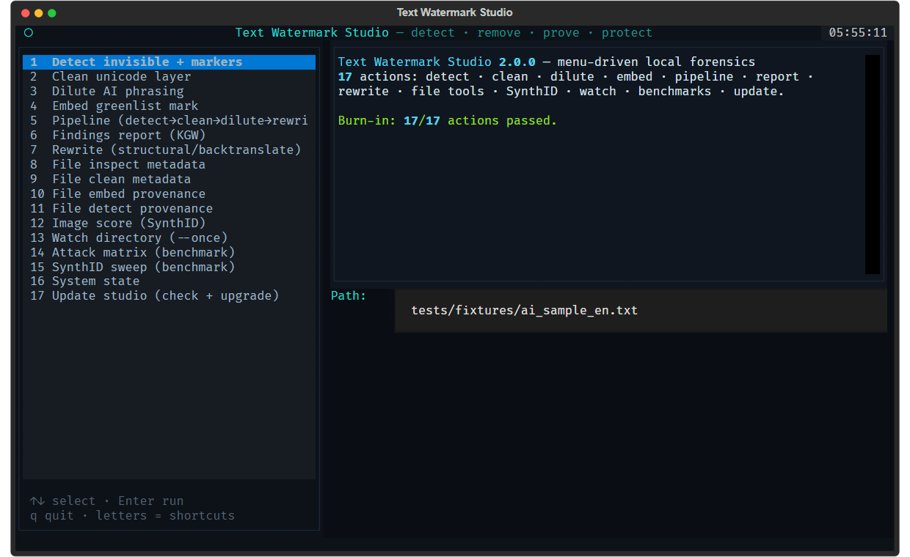

# Text Watermark Studio — User Guide

Version 2.0.0 · MIT · 100% local, zero telemetry

This guide covers everything the toolkit can do, how to verify that it works,
and — with equal care — what it honestly cannot do.

---

## 1. Overview

Text Watermark Studio is a local forensics laboratory for AI text and file
watermarks. It runs entirely on your machine; nothing is sent to a cloud.

It works in both directions:

- **Detect** marks that others left behind — invisible unicode, AI phrasing
  patterns, and statistical sampling watermarks (KGW family).
- **Remove** them — clean, dilute, rewrite.
- **Prove** findings — a Z-score you can defend, not a "looks like AI" vibe.
- **Protect** your own content — greenlist marks on text, HMAC provenance
  signatures on files.

Supported surfaces:

| Surface | Detect | Clean | Embed | Detect-own |
|---|---|---|---|---|
| Text (unicode / phrasing) | ✅ | ✅ | — | — |
| Text (statistical, KGW) | ✅ | — | ✅ | ✅ |
| Files (metadata: C2PA/EXIF/XMP) | ✅ | ✅ | — | — |
| Files (provenance, HMAC) | ✅ | — | ✅ | ✅ |
| Images (SynthID pixels) | ✅ (via external checkpoint) | — | — | — |

---

## 2. Installation

Requires Python 3.10+.

```bash
# Core install
pip install text-watermark-studio

# With BPE token-level detection (cl100k via tiktoken)
pip install text-watermark-studio[bpe]

# With the menu-driven terminal UI (textual)
pip install text-watermark-studio[tui]
```

From source:

```bash
git clone https://github.com/mrmixx-max/text-watermark-studio.git
cd text-watermark-studio
python -m venv .venv
# Windows: .\.venv\Scripts\activate | macOS/Linux: source .venv/bin/activate
pip install -e ".[dev,bpe]"
```

Verify the install:

```bash
ai-wm splash
ai-wm --help
```

---

## 3. Quickstart

```bash
# Scan a text for invisible characters and AI markers
ai-wm detect article.txt

# JSON output (default; --pretty for humans)
ai-wm detect article.txt --json

# Clean the unicode layer, write to a new file
ai-wm clean article.txt -o clean.txt

# Rewrite marker-heavy phrasing (three intensities)
ai-wm dilute clean.txt --intensity standard -o diluted.txt

# Run the whole chain: detect -> clean -> dilute -> rewrite -> detect
ai-wm pipeline article.txt --rewrite-mode structural -o final.txt

# Test a text against a KGW key
ai-wm report article.txt --key demo-kgw-1 --pdf

# Watch a folder for new files, report metadata + provenance findings
ai-wm watch ./incoming --once
```

---

## 4. Concepts: the three layers

AI systems mark output on three layers. None are visible to the eye.

**Layer 1 — Invisible characters.** Bidirectional controls (LRE, RLE, LRO,
RLO, PDF, isolates), zero-width spaces, joiners, tag blocks, deprecated
format characters. Survive copy-paste, change nothing visually.

**Layer 2 — Style markers.** Statistical fingerprints in phrasing: 18 AI
phrasing patterns including inflected forms.

**Layer 3 — Statistical watermarks.** KGW, SynthID-text and relatives bias
token choice *during generation*. No character, no phrase — a distribution.
Detectable only with the right key and a statistical test (Z-score).

Layers 1 and 2 are removed with `clean`/`dilute`. Layer 3 is measured, not
removed: `detect_kgw` reports whether a mark is present, with a score.

---

## 5. CLI reference

17 subcommands. Exit codes: `0` clean, `1` findings/error/unavailable,
`2` input error. `ai-wm tui` launches the menu-driven terminal UI (see §6).

### detect
```bash
ai-wm detect [input] [--stdin] [--lang auto|de|en] [--json] [--pretty]
             [--aggressive] [-o OUTPUT]
```
Finds unicode/stego and AI phrasing markers. `--aggressive` additionally
flags script-specific fillers (Braille blank, Hangul, Khmer, ...) — opt-in
because it can hit legitimate content.

### clean
```bash
ai-wm clean [input] [--stdin] [--nfkc] [--fold-confusables] [-o OUTPUT]
            [--report REPORT]
```
Strips the unicode layer. `--nfkc` normalizes compatibility forms,
`--fold-confusables` maps lookalike glyphs.

### dilute
```bash
ai-wm dilute [input] [--stdin] --intensity light|standard|aggressive [-o OUTPUT]
```
Rewrites marker-heavy phrasing, 33 rules with protected tokens.

### embed
```bash
ai-wm embed [input] [--stdin] --key KEY [--gamma GAMMA] [-o OUTPUT]
```
Greenlist-embeds a text. `--key` must reference a key_id from
`data/key_registry.json` that carries a secret.

### pipeline
```bash
ai-wm pipeline [input] [--stdin] [--lang auto|de|en] [--nfkc]
               [--fold-confusables] --intensity light|standard|aggressive
               [--rewrite-mode clarity|concise|plain|formal|structural|backtranslate]
               [--aggressive] [-o OUTPUT] [--report REPORT]
```
The full chain: detect → clean → dilute → rewrite → detect. `rewrite_mode`
defaults to off; enable it explicitly.

### report
```bash
ai-wm report [input] [--stdin] --key KEY [--lang en|de] [--pdf] [-o OUTPUT]
```
Self-contained HTML forensics report: Z-score, green rate, p-value,
invisible-character table, recommendation. `--pdf` renders via Edge headless
(Windows). Output defaults to `tws-report-<ts>.html`.

### watch
```bash
ai-wm watch DIRECTORY [--once] [--interval SECONDS]
```
Polls a folder (stdlib, no dependencies), emits JSON lines per file with
metadata and provenance findings. `--once` runs a single pass and exits
(safe for scripts and cron).

### rewrite
```bash
ai-wm rewrite [input] [--stdin] --mode clarity|concise|plain|formal|structural|backtranslate
              [--use-llm] [--no-preserve] [--json] [-o OUTPUT]
```
`structural` is rule-based (sentence rotation, anchors first/last).
`backtranslate` needs the local LLM backend (see §12). `--use-llm` forces
the LLM backend for the other modes.

### image-score
```bash
ai-wm image-score INPUT [--synthid-dir PATH] [--json]
```
Scores an image for SynthID pixel marks. Requires the external checkpoint
(see §10); without it, reports `available: false` honestly and exits 1.

### batch
```bash
ai-wm batch INPUT_DIR OUTPUT_DIR [--mode detect|clean|dilute|pipeline]
              [--lang auto|de|en] [--intensity ...] [--report REPORT]
```
Runs a mode over every file in a directory.

### serve
```bash
ai-wm serve [--host HOST] [--port PORT]
```
Starts the FastAPI server (see §13).

### file-inspect / file-clean / file-embed / file-detect
```bash
ai-wm file-inspect doc.pdf [--json]
ai-wm file-clean  doc.pdf -o clean.pdf [--json]
ai-wm file-embed  doc.pdf --key KEY -o signed.pdf
ai-wm file-detect signed.pdf [--json]
```
Inspect/clean metadata (C2PA/EXIF/XMP), sign files with HMAC provenance,
verify signatures. Supported formats: PNG, JPEG, SVG, PDF, DOCX, ODT, HTML,
Markdown.

### splash
```bash
ai-wm splash
```
Studio banner + system state.

---

## 6. Menu-driven terminal UI

```bash
ai-wm tui
```

A menu-driven Textual interface (install with
`pip install text-watermark-studio[tui]`). Dark studio theme matching the
repo's hero infographic. 17 menu entries — detect, clean, dilute, embed,
pipeline, report, rewrite, the four file tools, SynthID scoring, directory
watch, both benchmarks, system state, and update.

Navigation:

- `↑`/`↓` move through the menu from anywhere (app-level priority bindings
  — cursor keys drive the menu even while the Path field is focused)
- `Enter` runs the selected action
- letter shortcuts: `d` detect · `c` clean · `e` embed · `p` pipeline ·
  `r` report · `s` splash · `q` quit · `^p` command palette
- the Path field at the bottom takes a file or directory path; most actions
  read it, then write results to the output panel

**Update:** entry 17 checks the installed version against PyPI and runs
`pip install --upgrade text-watermark-studio` when a newer release exists.

**Burn-in:** `python benchmarks/tui_burnin.py` drives all 17 actions through
a real sample file headlessly and fails loudly on any exception — the
pre-release gate for the UI.



---

## 7. KGW statistical watermark detection

The detector implements the KGW (Kirchenbauer et al.) greenlist scheme:

1. A PRF hash of `(key, previous token)` selects a greenlist of ~γ of the
   vocabulary.
2. Watermarked text uses green tokens more often than chance.
3. The Z-score of the green count tests that bias: `Z = (green − γn) /
   √(nγ(1−γ))`.

Verdicts: `Z ≥ 4.0` watermark_detected · `2.0 ≤ Z < 4` weak_signal ·
`Z < 2.0` no_signal. `γ` defaults to 0.25 (`--gamma` on `embed`,
`DEFAULT_GAMMA` in `forensics/kgw.py`).

### Multi-key with Bonferroni

`detect_multi_key(text, keys)` tests a list of keys and applies Bonferroni
correction so that running many keys does not inflate false positives.

### Token levels (2.0.0)

```python
from ai_watermark_toolkit.forensics.kgw import detect_kgw

detect_kgw(text, "my-key", level="word")   # fast approximation (default)
detect_kgw(text, "my-key", level="bpe")    # cl100k subwords, model-grade
```

`level="bpe"` hashes greenlist over cl100k subword tokens **at word
boundaries** — the surface a real tokenizer feeds sampling watermarks. Mark
and detect round-trip on the same level. `level="word"` lowercases and
scores whole words.

### The end-to-end proof

`benchmarks/kgw_e2e_proof.py` runs the full round-trip against a real local
model (default `eurollm-9b:latest` via Ollama): generate text → impose the
greenlist on the foreign model's own tokens → detect. Measured:

| Measurement | Result |
|---|---|
| Unmarked model text, right key | z = 0.6, no signal |
| Marked text, right key | **z = 15.9, watermark_detected** |
| Marked text, wrong key | z = −0.2, no signal |

---

## 8. Embedding your own marks

**Text:** `ai-wm embed text.txt --key demo-kgw-1` (or
`mark_greenlist()` in code) imposes the greenlist by substituting green
words from a frequency pool. The mark is keyed: only the key holder detects
it; a wrong key reports no signal.

Honest caveat: substitutions come from a frequency vocabulary, not
synonyms — word-for-word nuance is not preserved. This is the documented
approximation of token-sampling watermarking from text-only rewriting.

**Files:** see §8.

Keys live in `data/key_registry.json`. The shipped `demo-kgw-1` key carries
a public demo secret — replace it before real use:

```json
{"keys": [{"key_id": "my-key", "family": "kgw", "status": "active",
           "owner": "local", "secret": "<your-secret>"}]}
```

---

## 9. File provenance (HMAC)

`file-embed`/`file-detect` sign files with an HMAC over the original
content and store the mark in the file (XMP-style packet). 8 formats:
PNG, JPEG, SVG, PDF, DOCX, ODT, HTML, Markdown.

Properties:

- **Content-bound:** flipping any byte of the content breaks the signature.
- **Keyed:** only the secret holder can set *or* forge a valid mark.
- **`found`/`valid` pair:** distinguishes "wrong key" from "tampered
  content".

```bash
ai-wm file-embed  report.pdf --key my-key -o signed.pdf
ai-wm file-detect signed.pdf --key my-key --json
# {"found": true, "valid": true, ...}
```

---

## 10. Metadata stripping (C2PA / EXIF / XMP)

`file-inspect`/`file-clean` inspect and strip metadata:

- PNG: eXIf, XMP chunks
- JPEG: APP1/APP11 segments
- SVG: `<metadata>` elements
- PDF: XMP metadata streams
- DOCX/ODT: custom parts

Stdlib-only (zipfile, xml.etree, binary chunk parsers) — no dependency
weight.

---

## 11. SynthID (pixel scoring)

SynthID's model is not redistributable here (220 MB, non-commercial
research license). The toolkit ships an adapter + bootstrap that builds it
from source when you choose to:

```bash
scripts/setup_synthid.sh --verify
```

`--verify` runs a real scoring pass on a generated test image after setup —
proof of "it actually works", not "it should work". Then:

```bash
ai-wm image-score photo.png
```

Without the checkpoint, `image-score` honestly reports `available: false`
and exits 1. The adapter never pretends.

---

## 12. Rewrite engine

`rewrite` and `pipeline --rewrite-mode` provide:

- **structural** — rule-based sentence rotation, first/last sentences
  anchored. Deterministic, no LLM.
- **backtranslate** — two LLM calls (DE→EN→DE) using the local LLM backend.
  Without a backend it degrades honestly to a structural shuffle and says so
  in the change log.

Local LLM backend (Ollama, OpenAI-compatible):

```bash
export LOCAL_LLM_ENABLED=1
export LOCAL_LLM_BASE_URL=http://127.0.0.1:11434/v1
export LOCAL_LLM_MODEL=eurollm-9b
```

**Any local model, not just EuroLLM** — the studio manages the Ollama
backend directly:

```bash
ai-wm llm list                  # all models the local Ollama knows
ai-wm llm install llama3.2:3b   # pull via the Ollama API + select
ai-wm llm use qwen-coder        # switch to an installed model
ai-wm llm status                # current backend config
```

`install` streams pull progress, verifies the model landed and points the
config (and `LOCAL_LLM_MODEL`) at it. Same action in the TUI: menu entry 18,
model name in the Path field.

---

## 13. Findings report & directory watcher (2.0.0)

`ai-wm report` produces a self-contained HTML report — KGW statistics,
invisible-character table, the analyzed text, and a recommendation —
with optional `--pdf` rendering.

`ai-wm watch` polls a directory and emits one JSON line per new/changed
file with `metadata` (inspect actions) and `provenance` (found/valid/key_id)
findings. Built for newsrooms, editors, incident response.

---

## 14. Benchmarks

Three reproducible scripts in `benchmarks/` (deterministic by default, no
LLM needed):

| Script | What it measures |
|---|---|
| `attack_matrix.py` | Z-score drop per attack: structural, dilute (3 intensities), unicode spam, word shuffle |
| `attack_matrix_v2.py` | Blackbox v2: N real EuroLLM generations + post-hoc KGW mark (γ=0.25), attack matrix with ΔZ, 100-token window analysis; cached in %TEMP%, reproducible without Ollama via `--skip-generation` |
| `synthid_sweep.py` | Detection curve: gamma × paraphrase-rate grid |
| `kgw_e2e_proof.py` | Full round-trip against a real local model |

Honest attack-matrix finding: style attacks (dilute, unicode spam,
rule-based structural rewrite) do **not** break the greenlist mark; word
permutation does (z drops to ~−1.4). The detection curve shows the mark
survives roughly 45–60% lexical churn depending on γ.

---

## 15. API server

```bash
ai-wm serve --port 8000
```

FastAPI app with routes for text processing (`/api/pipeline`, `/api/rewrite/run`),
metadata (`/api/metadata/inspect|clean|synthid-score|file-embed|file-detect`),
plus `/health` and `/ready` probes. Swagger UI at `/docs`.

---

## 16. MCP tools & Hermes skills

The repo bundles MCP tools and 5 Hermes skills
(`hermes/skills/text-watermark-studio-lab/`) with class-level vendor notes
for Claude, Gemini/SynthID and OpenAI — what each vendor's watermarking is
verifiably known to do vs. best-effort claims.

---

## 17. Security model & honest limitations

- **No rule-based detector defeats a vendor's sampling watermark applied at
  logit level by a model you don't control.** What this toolkit gives you is
  the measurement: if the mark is there, it's found, with a defensible
  Z-score.
- **Pixel-watermark removal is not a goal.** Attempts to remove visible or
  invisible image watermarks are out of scope by design.
- **"Pangram-safe" means:** no known markers/tropes/stego patterns remain.
  It is not a guarantee against unknown schemes.
- Everything runs locally; no telemetry. Verify: the code is MIT and short
  enough to read.

---

## 18. Troubleshooting

| Symptom | Fix |
|---|---|
| `ModuleNotFoundError: tiktoken` | `pip install text-watermark-studio[bpe]` |
| `image-score` exits 1 | Checkpoint not set up — run `scripts/setup_synthid.sh --verify` |
| `rewrite --mode backtranslate` gives structural result | LLM backend not configured — set `LOCAL_LLM_*` env vars (§11) |
| `embed` exits 2 | `--key` references a key_id without a secret in `data/key_registry.json` |
| `watch` reports `unsupported` format | File type not in the metadata layer's supported set — expected, honest signal |

---

## 19. Development & testing

```bash
pip install -e ".[dev,bpe]"
pytest tests/          # 195 tests, deterministic, no network
python benchmarks/attack_matrix.py
```

CI runs on Windows and Linux. Tests use `tmp_path` isolation — no test
writes into tracked `data/` files.

---

## 20. Local corpus similarity

```bash
ai-wm similarity text.txt --corpus ./archiv [--threshold 0.4] [--top 5] [--json]
```

MinHash fingerprint comparison of a text against **your own** document
corpus. Deterministic, offline, with fundstelle quotes as evidence.
Exit code `1` when findings exceed the threshold, `0` otherwise.

**Honest boundary (by design):** similarity measures literal overlap
(5-gram MinHash signatures), not paraphrased meaning. A heavily rewritten
copy scores low — the report says so. No web crawl, no hidden corpus, no
"plagiarism proof": similarity to *these* sources, nothing more. Binary or
unreadable corpus files are listed as skipped, not treated as errors.

---

License: MIT · Repository: <https://github.com/mrmixx-max/text-watermark-studio>
PyPI: <https://pypi.org/project/text-watermark-studio>
